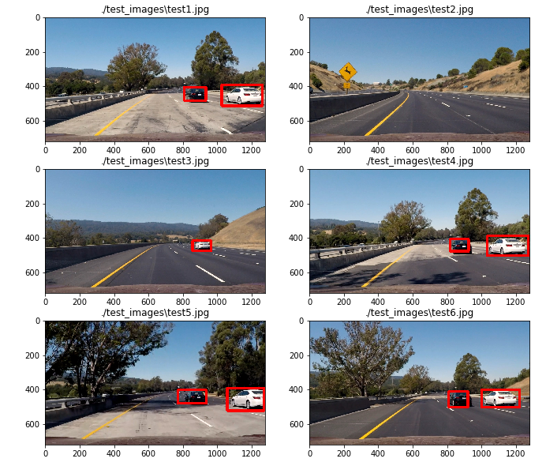

# Vehicle Detection

The goal of this project is to write a software pipeline to detect vehicles in a video
(start with the test_video.mp4 and later implement on full project_video.mp4),
but the main output or product is to create is a detailed writeup of the project.

## A Brief Comparison of Object Detection Algorithms
There are many algorithms in object detection. The following are a few popular ones and their comparison

### HOG + SVM
[HOG+SVM](https://hal.inria.fr/inria-00548512/document)
 is a traditional computer vision techniques. It applies HOG (Histogram of Oriented Gradients)
feature extraction, and color transformation to train SVM (Surport Vector Machine) classifier using labeled images.
Then applies sliding windows technique to track objects in a video.

The problem with HOG + SVM approach, as with the traditional machine learning approach, is the performance.
First the algorithm itself requires dividing an image into small patches, and each patch will be run through a classifier
to determine whether there are objects in the patch. Second there is no supportive packages for traditional machine learning
to utilize the power of GPU. Based on readings, the HOG + SVM approach can be difficult to reach the real time object detection
performance that requires 30 frame per second.

### Fast R-CNN
[Fast R-CNN](https://arxiv.org/pdf/1504.08083.pdf)
 is an object detection algorithm proposed by Ross Girshick in 2015.

Fast R-CNN builds on previous work R-CNN [Region-based Convolutional Network](https://arxiv.org/abs/1311.2524).
R-CNN uses a deep ConvNet to classify object proposals. R-CNN is slow because it performs a ConvNet forward pass
for each object proposal, without sharing computation.
R-CNN's performance problem are mainly in: extremely slow training due to multi-stage training;
large storage due to features have to be written to disk; slow prediction
due to features have to be extracted from each object proposal in each image.
Object detection by R-CNN with VGG16 is 47 sec /image using GPU.

The Fast R-CNN improved performace in the following areas:
1. Training is single-stage, using a multi-task loss. Training can update all network layers.
(It cut down training time on VGG16 from R-CNN's 25.5 hours to 9.5 hours).
2. Fast R-CNN uses the softmax classifier learnt during fine-tuning instead of training one-vs-rest linear SVMs
3. No disk storage is required for feature caching

The detection time for Fast R-CNN is arount 0.32 sec/image or 3 frame per second.

### Faster R-CNN
[Faster R-CNN](https://arxiv.org/pdf/1506.01497.pdf) was proposed by Shaoqing Ren, Kaiming He, Ross Girshick, and Jian Sun.
It introduces a Region Proposal Network (RPN) which is a fully-convolutional network that simultaneously predicts
object bounds and objectness scores at each position. RPN and Fast R-CNN can be trained to share convolutional features.
In simple workds, it first predicts which parts of the image contain interesting information — so-called region proposals —
and then run the classifier only on these regions. The classifier has to do less work than with the sliding windows.
For the very deep VGG-16 model, Faster R-CNN achieved object detection with a frame rate of 5 FPS on a GPU.

### YOLO
[YOLO](https://pjreddie.com/darknet/yolo/)
is fundamentally different with previous object detection system, in the sense that it takes a regression approach,
while all previous system (HOG+SVM, R-CNN, Fast R-CNN, Faster R-CNN) are classification based.
In a classification based object detection system, an image is divided into many small patches,
each patch is run through a classifier to determine whether there are objects in the patch.
Then the bounding boxes will be assigned to locate around patches that are classified with high probability of an object's presence.
Despite the optimization of RPN (run the classfier on interested ragion), the classafier still gets run many times over.
It causes classfication based objecte detection system slow.

YOLO attempts to solve object detection as a single regression problem,
straight from image pixels to bounding box coordinates and class probabilities.
It first divides the image into regions, a single convolutional network simultaneously predicts multiple bounding boxes and
their weighted probabilities for each region, as well as object class probabilities for those boxes. At the end, the boxes with highest probability were chosen.
Because a single network was run once on the full image, it comes the name YOLO (You Only Look Once).

Many articles described how YOLO works in great details, such as this [blog](http://machinethink.net/blog/object-detection-with-yolo/),
this [post](https://towardsdatascience.com/yolo-you-only-look-once-real-time-object-detection-explained-492dc9230006),
and latest paper [YOLOv2](https://arxiv.org/pdf/1612.08242.pdf), and previous paper [YOLO](https://arxiv.org/pdf/1506.02640.pdf)

The obvious advantage of YOLO is that it's very fast. It achieved real time object detection performance of 40-90 FPS on Titan X GPU.

Other [reference](http://slazebni.cs.illinois.edu/spring17/lec07_detection.pdf)

## The Tiny-YOLO v1
Tiny YOLO is based off of the [Darknet reference network](https://pjreddie.com/darknet/imagenet/#reference)
 and is much faster. Although less accurate than the normal YOLO model, it's reasonabily accurate
 to detect vehicle in the video of Udacity's self driving car project 5 based on my testing.
Besides simplicity, another advantage of Tiny-YOLO is that it's extremely fast.

### Architecture of CNN

The tiny YOLO v1 is consist of 9 convolution layers and 3 full connected layers.
Each convolution layer consists of convolution, leaky relu and max pooling operations.
The first 9 convolution layers are functioned as the feature extractor,
whereas the last three full connected layers are dunctioned as the "regression head" that predicts the bounding boxes.

The detail of the architecture is in list in this table:

____________________________________________________________________________________________________
Layer (type)                     Output Shape          Param #     Connected to
====================================================================================================
convolution2d_1 (Convolution2D)  (None, 16, 448, 448)  448         convolution2d_input_1[0][0]
____________________________________________________________________________________________________
leakyrelu_1 (LeakyReLU)          (None, 16, 448, 448)  0           convolution2d_1[0][0]
____________________________________________________________________________________________________
maxpooling2d_1 (MaxPooling2D)    (None, 16, 224, 224)  0           leakyrelu_1[0][0]
____________________________________________________________________________________________________
convolution2d_2 (Convolution2D)  (None, 32, 224, 224)  4640        maxpooling2d_1[0][0]
____________________________________________________________________________________________________
leakyrelu_2 (LeakyReLU)          (None, 32, 224, 224)  0           convolution2d_2[0][0]
____________________________________________________________________________________________________
maxpooling2d_2 (MaxPooling2D)    (None, 32, 112, 112)  0           leakyrelu_2[0][0]
____________________________________________________________________________________________________
convolution2d_3 (Convolution2D)  (None, 64, 112, 112)  18496       maxpooling2d_2[0][0]
____________________________________________________________________________________________________
leakyrelu_3 (LeakyReLU)          (None, 64, 112, 112)  0           convolution2d_3[0][0]
____________________________________________________________________________________________________
maxpooling2d_3 (MaxPooling2D)    (None, 64, 56, 56)    0           leakyrelu_3[0][0]
____________________________________________________________________________________________________
convolution2d_4 (Convolution2D)  (None, 128, 56, 56)   73856       maxpooling2d_3[0][0]
____________________________________________________________________________________________________
leakyrelu_4 (LeakyReLU)          (None, 128, 56, 56)   0           convolution2d_4[0][0]
____________________________________________________________________________________________________
maxpooling2d_4 (MaxPooling2D)    (None, 128, 28, 28)   0           leakyrelu_4[0][0]
____________________________________________________________________________________________________
convolution2d_5 (Convolution2D)  (None, 256, 28, 28)   295168      maxpooling2d_4[0][0]
____________________________________________________________________________________________________
leakyrelu_5 (LeakyReLU)          (None, 256, 28, 28)   0           convolution2d_5[0][0]
____________________________________________________________________________________________________
maxpooling2d_5 (MaxPooling2D)    (None, 256, 14, 14)   0           leakyrelu_5[0][0]
____________________________________________________________________________________________________
convolution2d_6 (Convolution2D)  (None, 512, 14, 14)   1180160     maxpooling2d_5[0][0]
____________________________________________________________________________________________________
leakyrelu_6 (LeakyReLU)          (None, 512, 14, 14)   0           convolution2d_6[0][0]
____________________________________________________________________________________________________
maxpooling2d_6 (MaxPooling2D)    (None, 512, 7, 7)     0           leakyrelu_6[0][0]
____________________________________________________________________________________________________
convolution2d_7 (Convolution2D)  (None, 1024, 7, 7)    4719616     maxpooling2d_6[0][0]
____________________________________________________________________________________________________
leakyrelu_7 (LeakyReLU)          (None, 1024, 7, 7)    0           convolution2d_7[0][0]
____________________________________________________________________________________________________
convolution2d_8 (Convolution2D)  (None, 1024, 7, 7)    9438208     leakyrelu_7[0][0]
____________________________________________________________________________________________________
leakyrelu_8 (LeakyReLU)          (None, 1024, 7, 7)    0           convolution2d_8[0][0]
____________________________________________________________________________________________________
convolution2d_9 (Convolution2D)  (None, 1024, 7, 7)    9438208     leakyrelu_8[0][0]
____________________________________________________________________________________________________
leakyrelu_9 (LeakyReLU)          (None, 1024, 7, 7)    0           convolution2d_9[0][0]
____________________________________________________________________________________________________
flatten_1 (Flatten)              (None, 50176)         0           leakyrelu_9[0][0]
____________________________________________________________________________________________________
dense_1 (Dense)                  (None, 256)           12845312    flatten_1[0][0]
____________________________________________________________________________________________________
dense_2 (Dense)                  (None, 4096)          1052672     dense_1[0][0]
____________________________________________________________________________________________________
leakyrelu_10 (LeakyReLU)         (None, 4096)          0           dense_2[0][0]
____________________________________________________________________________________________________
dense_3 (Dense)                  (None, 1470)          6022590     leakyrelu_10[0][0]
____________________________________________________________________________________________________
Total params: 45,089,374
Trainable params: 45,089,374
Non-trainable params: 0
____________________________________________________________________________________________________

### Implementation of Tiny-YOLO
Keras witn TensorFlow backend was used to build Tiny-YOLO model.

To save training time, the pretrained weights was downloaded from [here](https://drive.google.com/file/d/0B1tW_VtY7onibmdQWE1zVERxcjQ/view?usp=sharing)

The project includes the following files:
* ./mode/model.py contains the implementation of Tiny-YOLO model in Python
* p5-vehicle-detection.ipynb contains the visualization of apply Tiny-YOLO model to test images, and generating project video
* ./output_images/obj_detected_test_images.png is the screenshot of vehicle detected in the test images
* ./project_video_output.mp4 is the project output video with vehicle detected
* ./README.md is the project writeup
*./carnd-term1-p5.yaml is the conda enviroment file

### Results

The following shows the results for several test images with a threshold of 0.20. The cars in the images are detected:

[Here](./project_video_output.mp4) is the result of applying the Tiny-YOLO pipeline to a video.

### Performance
The following is the time took to process project_video.mp4 using Tiny-YOLO model using CPU.
Anticipate much better performance with GPU.

    Time: 2min 14s = 134 sec
    project_video.mp4: 25 frame/sec, 50 sec
    Total frame = 1250

    Performance: 9.3 FPS with CPU

Other References:

https://andrewliao11.github.io/object_detection/faster_rcnn/b

